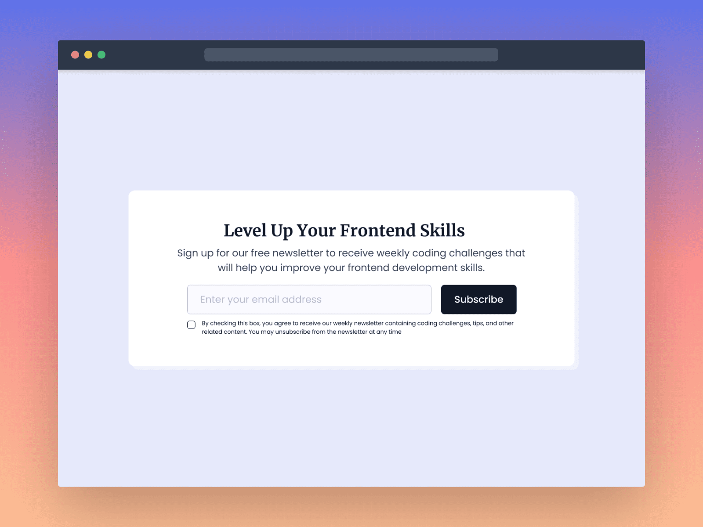

# newsletter-card-component
Welcome to the Newsletter Card Component repository. Here, you can find a newsletter signup box made with HTML and SCSS(a type of CSS). It's easy to add to your website, looks good on all devices, and you can change it as you like.

# Overview
This project hosts a customizable HTML and SCSS-based newsletter sign-up component designed to be seamlessly integrated into any website. It's responsive, ensuring it works across all devices, and it's styled using SCSS for easy customization.

# Features
- Responsive Design: Adapts to any screen size for optimal viewing.
- Customizable Styling: Modify the SCSS to match your site’s theme.

# Getting Started
To implement the newsletter card on your website, follow these steps:
1. Clone the repository: git clone https://github.com/Ghazali-Sufi/newsletter-card-component.git
2. Navigate to the project directory: cd newsletter-card-component
3. Include the HTML and SCSS:
  . Add the HTML code from index.html to your webpage.
  . Integrate SCSS from index.scss into your project's styling or compile it to CSS and link it in your HTML.

# Contact
LinkedIn – https://so.linkedin.com/in/mghazaali
Facebook - https://www.facebook.com/MGhazaali
Project Link: https://github.com/Ghazali-Sufi/newsletter-card-component.git

=======

**Challenge Title**
Newsletter Card Component

**Challenge Description**
In this frontend challenge, you'll build a Newsletter Card Component. This challenge is perfect for you if you've been learning HTML and CSS and are looking to practice what you've learned by building something new and beginner-friendly.

**Difficulty Level**
Beginner

**Tags**
FRONTEND

**Learning**
In this frontend challenge, you'll learn how to build a real-world UI component using HTML & CSS. You'll also learn how to use CSS Flexbox to lay out the component and make it responsive. This frontend challenge is a great opportunity to improve your HTML & CSS skills by building a beginner-friendly frontend project. So what are you waiting for?

**Requirements**

- The Newsletter Card Component should have an email input field for the user to enter their email address and a subscribe button.
- An email input field should be validated before the user can submit the form.
- If the email address is not valid, an error alert message should be displayed to the user.
- When the user clicks on the subscribe button, a success message should be displayed to the user.
- Show the hover state of all the elements.
- The component should be responsive and display correctly on different screen sizes.
- Make this landing page look as close to the design as possible.

I hope you'll enjoy building this challenge.
